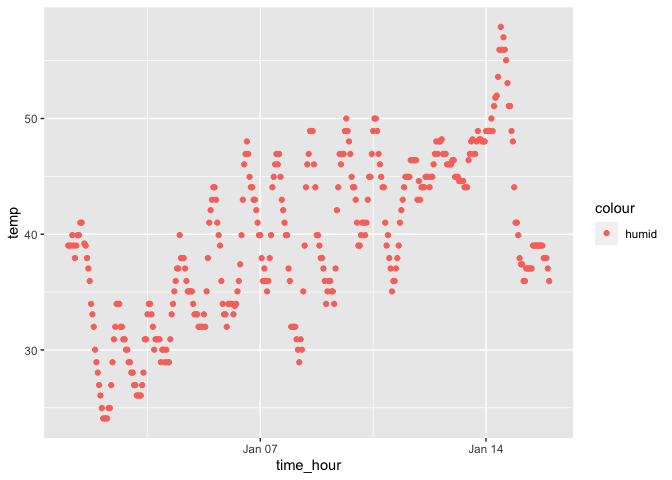

p8105_hw1_yc4384
================
Yangyang Chen
2023-09-17

## Problem_1

``` r
#Introduce the dataset
library(moderndive)
data("early_january_weather") #load dataset
str(early_january_weather) #the variables in this dataset, including names / values of important variables
```

    ## tibble [358 × 15] (S3: tbl_df/tbl/data.frame)
    ##  $ origin    : chr [1:358] "EWR" "EWR" "EWR" "EWR" ...
    ##  $ year      : int [1:358] 2013 2013 2013 2013 2013 2013 2013 2013 2013 2013 ...
    ##  $ month     : int [1:358] 1 1 1 1 1 1 1 1 1 1 ...
    ##  $ day       : int [1:358] 1 1 1 1 1 1 1 1 1 1 ...
    ##  $ hour      : int [1:358] 1 2 3 4 5 6 7 8 9 10 ...
    ##  $ temp      : num [1:358] 39 39 39 39.9 39 ...
    ##  $ dewp      : num [1:358] 26.1 27 28 28 28 ...
    ##  $ humid     : num [1:358] 59.4 61.6 64.4 62.2 64.4 ...
    ##  $ wind_dir  : num [1:358] 270 250 240 250 260 240 240 250 260 260 ...
    ##  $ wind_speed: num [1:358] 10.36 8.06 11.51 12.66 12.66 ...
    ##  $ wind_gust : num [1:358] NA NA NA NA NA NA NA NA NA NA ...
    ##  $ precip    : num [1:358] 0 0 0 0 0 0 0 0 0 0 ...
    ##  $ pressure  : num [1:358] 1012 1012 1012 1012 1012 ...
    ##  $ visib     : num [1:358] 10 10 10 10 10 10 10 10 10 10 ...
    ##  $ time_hour : POSIXct[1:358], format: "2013-01-01 01:00:00" "2013-01-01 02:00:00" ...

``` r
nrow(early_january_weather) #the size of the dataset
```

    ## [1] 358

``` r
ncol(early_january_weather) # the size of the dataset
```

    ## [1] 15

``` r
attach(early_january_weather) #Make a scatterplot of temp (y) vs time_hour (x)
```

    ## The following objects are masked from package:datasets:
    ## 
    ##     precip, pressure

``` r
mean(temp)#The mean
```

    ## [1] 39.58212

``` r
cat("There are 15 variables in the dataset. The variable 'origin' is an character type variable, and variable 'wind_gust' includes all NA values.")
```

    ## There are 15 variables in the dataset. The variable 'origin' is an character type variable, and variable 'wind_gust' includes all NA values.

``` r
cat("The dataset has 358 rows and 15 columns.")
```

    ## The dataset has 358 rows and 15 columns.

``` r
cat("The mean of 'temp' is 39.58212.")
```

    ## The mean of 'temp' is 39.58212.

``` r
#Scatterplot of dataset and save image
library(ggplot2)
scatter_plot = ggplot(early_january_weather, aes(x = time_hour, y= temp, color = 'humid')) #color points using the humid variable
scatter_plot + geom_point()
```

<!-- -->

``` r
cat("The temperature is fluctuated increasing from 30 to 50 on Jan_01 to Jan_15.")
```

    ## The temperature is fluctuated increasing from 30 to 50 on Jan_01 to Jan_15.

``` r
ggsave("scatterplot.png", plot = scatter_plot + geom_point(), width = 6, height = 4) #Export scatterplot to the project directory
```

## Problem_2

``` r
#Create a dataset
v1 = rnorm(10) #a random sample of size 10 from a standard Normal distribution
v2 = ifelse(v1>0, "T", "F") #a logical vector indicating whether elements of the sample are greater than 0
v3 = c('a','b','c','d','e','f','g','h','i','j') #a character vector of length 10
v4 = c('1','2','3','3','2','1','2','3','1','3') #a factor vector of length 10, with 3 different factor “levels”
df = data.frame(v1,v2,v3,v4) #create a data frame
df
```

    ##             v1 v2 v3 v4
    ## 1   0.78003953  T  a  1
    ## 2  -0.82222368  F  b  2
    ## 3  -0.21684359  F  c  3
    ## 4   1.62474257  T  d  3
    ## 5   0.03110013  T  e  2
    ## 6  -0.62552091  F  f  1
    ## 7  -0.41718989  F  g  2
    ## 8   0.30748414  T  h  3
    ## 9  -0.45096602  F  i  1
    ## 10 -1.64616638  F  j  3

``` r
#Compute mean of each vector
library(tidyverse)# Use pull() to extract the each column as a vector
```

    ## ── Attaching core tidyverse packages ──────────────────────── tidyverse 2.0.0 ──
    ## ✔ dplyr     1.1.3     ✔ readr     2.1.4
    ## ✔ forcats   1.0.0     ✔ stringr   1.5.0
    ## ✔ lubridate 1.9.2     ✔ tibble    3.2.1
    ## ✔ purrr     1.0.2     ✔ tidyr     1.3.0
    ## ── Conflicts ────────────────────────────────────────── tidyverse_conflicts() ──
    ## ✖ dplyr::filter() masks stats::filter()
    ## ✖ dplyr::lag()    masks stats::lag()
    ## ℹ Use the conflicted package (<http://conflicted.r-lib.org/>) to force all conflicts to become errors

``` r
vector <- df %>% pull(v1)
mean(vector)
```

    ## [1] -0.1435544

``` r
vector <- df %>% pull(v2)
mean(vector)
```

    ## Warning in mean.default(vector): argument is not numeric or logical: returning
    ## NA

    ## [1] NA

``` r
vector <- df %>% pull(v3)
mean(vector)
```

    ## Warning in mean.default(vector): argument is not numeric or logical: returning
    ## NA

    ## [1] NA

``` r
vector <- df %>% pull(v4)
mean(vector)
```

    ## Warning in mean.default(vector): argument is not numeric or logical: returning
    ## NA

    ## [1] NA

``` r
# Convert variables from one type to another and calculate their means
vector <- df %>% pull(v2)
mean(as.numeric(vector))
```

    ## Warning in mean(as.numeric(vector)): NAs introduced by coercion

    ## [1] NA

``` r
vector <- df %>% pull(v3)
mean(as.numeric(vector))
```

    ## Warning in mean(as.numeric(vector)): NAs introduced by coercion

    ## [1] NA

``` r
vector <- df %>% pull(v4)
mean(as.numeric(vector))
```

    ## [1] 2.1

``` r
print("Because v2 and v3 still are NA values after coercion, therefore they don't have mean values.")
```

    ## [1] "Because v2 and v3 still are NA values after coercion, therefore they don't have mean values."
